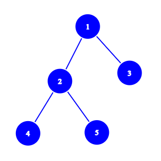

# TarPy Assignment

## Description :
This project is about the implementation of the graph traversal and search processes over a graph of platforms using TarPy.

* depth first travrsal 
* depth first search
* breadth first traversal
* breadth first search

The project contains following files

* TarPy files
    * [platform_ubuntu.pl](./platform_ubuntu.pl "Tartarus")
    * [call_handler.pl](./call_handler.py "call handler")
    * [Tartarus.py](./Tartarus.py "TarPy")
* [graph.py](./graph.py "graph")
* [dft_behavior.py](./dft_behavior.py "dft behavior")
* [dfs_behavior.py](./dfs_behavior.py "dfs behavior")
* [bft_behavior.py](./bft_behavior.py "bft behavior")
* [bfs_behavior.py](./bfs_behavior.py "bfs behavior")
* [cleaner_behavior.py](./cleaner_behavior.py "cleaner behavior")
* [exelocker_behavior.py](./exelocker_behavior.py "exelocker behavior")
* [readme.md](./readme.md "readme")

---

## Scope of the Project :
### [Generation and initial execution.](#graph-generation-)
* The required graph of platforms with a choosen platform to execute the choosen process can be generated.
### [Preparing for further executions.](#cleaning-nodes-)
* The graph of platforms can be prepared for further executions of the procedures.
* This step is only needed if we execute depth first search( as rest of the procedures are self prepared ).
### [Runtime execution.](#further-execution-)
* All the procedures can be executed in runtime.
* For Depth first search and breadth first search the search key can be changed in runtime.
### [Alter the execution platform.](#changing-platform-)
* The choosen platform can be changed from default to any other platform in the graph.
### [Alter the platform details](#miscellaneous-)
* Some parameters of any platform can be changed in runtime.
---
## Execution Steps :
### **<u id="graph-generation-">Graph Generation</u>** :
* To generate the desired graph, start off by labelling the graph with numbers starting from 1( 1, 2, 3 ... ).
* Write the Adjacency list form of the graph.
* Choose a label for each node which would be used as a search key.
* Choose a node at which you want to intiate the processes. Also choose a search label for intializing the search key for the search processes.
   > The platform choosen for initiating the processes should be created last.
* Start the rest of the nodes in any order using
 
   ```
   python graph.py
   ```
* Enter the node number, label, neighbours( which is the Adjacency list of the node) and 0 as the execution flag( as we are not executing anything from the respective platform) as the inputs asked.
* It is same for the platform choosen for process intitation but, with the execution flag as per the process that you want to run first and the search key for search processes.
* As the python execution is done all further activites are to be done in prolog.
* The port number of the platform is generated from node number( if the node number is n then port number is 8000+2*n ) and the IP is localhost.
### <u id="cleaning-nodes-">**Cleaning Nodes**</u> :
* This step is needed only if depth first search is  executed( because all the other processes do not alter the platforms they visit or they will undo the changes finally).
* If depth first search is done then this step should be done to do any future activities.
* This can be done using
   ```
   agent_execute(cleaner,(localhost,<port>),mobile_handler).
   ```
   > where `<port>` should be replaced with the port number of the platform.

### <u id="further-execution-">**Further Execution**</u> :
* As the python execution is done all the further exections are done using prolog commands.
* Depth first traversal can be executed using
   ```
   agent_execute(dft,(localhost,<port>),mobile_handler).
   ```
 
 * Breadth first traversal can be executed using
   ```
   agent_execute(bft,(localhost,<port>),mobile_handler).
   ```
 
 * Depth first search can be executed using
   ```
   agent_execute(dfs,(localhost,<port>),mobile_handler)
   ```
 
   > Make sure that cleaning is done to execute further.

 * Breadth first search can be executed using
   ```
   agent_execute(bfs,(localhost,<port>),mobile_handler).
   ```
   > where `<port>` should be replaced with the port number of the platform.

 * For changing the search label of the depth first search functions.
 
   * Removing the previous search label can be done using
      ```
      retractall(tofind(dfs,_)).
      ```
   * Adding the new label can be done using
 
      ```
      asserta(tofind(dfs,"['<new_label>']")).
      ```
      > where `<new_label>` should be replaced with new search label.
  
 * For changing the search label of the breadth first search functions.

   * Removing the previous search label can be done using
 
      ```
      retractall(tofind(bfs,_)).
      ```
   * Adding the new label can be done using
      ```
      asserta(tofind(bfs,"['<new_label>']")).
      ```
      > where `<new_label>` should be replaced with new search label.
  
### <u id="changing-platform-">**Changing Platform**</U> :
* For changing the platform of exection we need to lock the execution of the processes first.
* The processes can be locked from execution using
   ```
   agent_execute(exelocker,(localhost,<port>),mobile_handler).
   ```
   > where `<port>` should be replaced with the port number of the platform.

* Before migrating the processes we need to change destination port of each process.

   * Removing the current destination port of all the processes can be done using
      ```
      retractall(next_add(_,_,_)).
      ```
   * Adding the new destination port to particular process can be done using
      ```
      asserta(next_add(dft,localhost,<port>)).
      ```
      ```
      asserta(next_add(bft,localhost,<port>)).
      ```
      ```
      asserta(next_add(dfs,localhost,<port>)).
      ```
      ```
      asserta(next_add(bfs,localhost,<port>)).
      ```
      ```
      asserta(next_add(cleaner,localhost,<port>)).
      ```
      ```
      asserta(next_add(exelocker,localhost,<port>)).
      ```
   respectively
   > where `<port>` should be replaced with the port number of the destnation platform.
* Migration of processes can be done in any order except that the exelocker should be migrated last.
* Migrating the processes can be done using

   ```
   move_agent(dft,(localhost,<port>)).
   ```
   ```
   move_agent(bft,(localhost,<port>)).
   ```
   ```
   move_agent(dfs,(localhost,<port>)).
   ```
   ```
   move_agent(bfs,(localhost,<port>)).
   ```
   ```
   move_agent(cleaner,(localhost,<port>)).
   ```
   ```
   move_agent(exelocker,(localhost,<port>)).
   ```
   respectively
   > where `<port>` should be replaced with the port number of the destnation platform previously added.
* The exelocker after the migration will automatically unlock the processes and will set the payloads as per the platform.
### <U id = "miscellaneous-">**Miscellaneous** </u>:
* The label assigned to a platform can be changed using prolog in runtime.

   * Removing the current label assigned to the platform can be done using
      ```
      retractall(label(_)).
      ```
   * Adding a new label to the platform can be done using
      ```
      asserta(label("['<new_label>']")).
      ```
      > where `<new_label>` should be replaced with the new label.
* The neighbours of a platform can be changed using prolog in runtime.
   * Removing the current neighbours of the platform can be done using
      ```
      retractall(neighbours(_)).
      ```
   * Adding the new neighbours list to the platform can be done using
      ```
      asserta(neighbours("[<new_neighbours>]")).
      ```
   > where `<new_neighbours>` should be replaced with "," seperated neighboring node's port numbers list(Ex. 8004,8006,8008 ).
   >
   > Changing neighbours of a platform won't change it's occurences in other platform's neighbours which may lead to inconsistency.
### <u>**Example Execution**</u> :
* Example graph of 5 node( labelled 1,2,3,4,5 ).
<p align="center"></p>

* The adjacency list of this graph is
  
   | node | neighbours |
   | ---- | ---------- |
   | 1 | 2, 3 |
   | 2 | 1, 4, 5 |
   | 3 | 1 |
   | 4 | 2 |
   | 5 | 2 |
* Adding coustom labels to the nodes

   | node | neighbours | labels |
   | ---- | ---------- | ------ |
   | 1 | 2, 3 | A |
   | 2 | 1, 4, 5 | B |
   | 3 | 1 | C |
   | 4 | 2 | D |
   | 5 | 2 | E |
* Let us take node 1 to execute the initial process, which means we should create node 1 after creating all the other node.
* Let us take the Depth first search to be the intial process and label ' C ' to be the search label placeholder.
* Generating the above example can be done using
   ```
   python graph.py
   ```
   command in different terminals with inputs
   | node | labels | neighbours | executionflag | search key |
   | ---- | ------ | ---------- | ------------- | ---------- |
   | 5 | E | 2 | 0| - |
   | 4 | D | 2 | 0| - |
   | 3 | C | 1 | 0| - |
   | 2 | B | 1, 4, 5 | 0| - |
   | 1 | A | 2, 3 | 3(for dfs) | C |
* This will generate the platform graph and execute dfs starting at node 1 with search key ' C '.
* The port number of the nodes are as follows
   | node | port |
   | ---- | ---- |
   | 1 | 8002 |
   | 2 | 8004 |
   | 3 | 8006 |
   | 4 | 8008 |
   | 5 | 8010 |
* Now to perform any further operations we should clean the rest of the nodes of the graph as we executed `DFS`.
* Cleaning is done by using prolog command
   ```
   agent_execute(cleaner,(localhost,8002),mobile_handler).
   ```
* Further execution of processes can be done using
   ```
   agent_execute(dft,(localhost,8002),mobile_handler).
   ``` 
   For depth first traversal
   ```
   agent_execute(bft,(localhost,8002),mobile_handler).
   ``` 
   For breadth first traversal
   ```
   agent_execute(dfs,(localhost,8002),mobile_handler).
   ``` 
   For cleaning the nodes after execution
   ```
   agent_execute(cleaner,(localhost,8002),mobile_handler).
   ``` 
   For depth first search
   ```
   agent_execute(bfs,(localhost,8002),mobile_handler).
   ``` 
   For breadth first search
* Changing the search label to ' B ' can be done by using
   ```
   retractall(tofind(dfs,_)).
   ```
   ```
   asserta(tofind(dfs,"['B']")).
   ```
   For depth first search
   ```
   retractall(tofind(bfs,_)).
   ```
   ```
   asserta(tofind(bfs,"['B']")).
   ```
   For breadth first search
* Migrating the processes to node 2 can be done using
   ```
   agent_execute(exelocker,(localhost,8002),mobile_handler).
   ```
   To lock the executions of all the processes upon migration.
   ```
   retractall(next_add(_,_,_)).
   ```
   To remove the current node's locations from the destination node information of the processes.
   ```
   asserta(next_add(dft,localhost,8004)).
   ```
   ```
   asserta(next_add(dfs,localhost,8004)).
   ```
   ```
   asserta(next_add(bft,localhost,8004)).
   ```
   ```
   asserta(next_add(bfs,localhost,8004)).
   ```
   ```
   asserta(next_add(cleaner,localhost,8004)).
   ```
   To add the desired location to the destination node information of the processes.
   > The port of node 2 is calculated as 8000+2x2 = 8004.
   ```
   move_agent(dft,(localhost,8004)).
   ```
   ```
   move_agent(dfs,(localhost,8004)).
   ```
   ```
   move_agent(bft,(localhost,8004)).
   ```
   ```
   move_agent(bfs,(localhost,8004)).
   ```
   ```
   move_agent(cleaner,(localhost,8004)).
   ```
   ```
   move_agent(exelocker,(localhost,8004)).
   ```
   To finally migrate all the processes to node 2
   > exelocker should be migrated last.
* Changing label of node 4 to ' top ' can be done using
   ```
   retractall(label(_)).
   ```
   To remove the old label
   ```
   asserta(label("['top']")).
   ```
   To add the label 'top' to the platform.
   > This should be performed on platform 4.
* Changing neighbours of node 5 to [2, 4] can be done using
   ```
   retractall(neighbours(_)).
   ```
   To remove old neighbours
   ```
   asserta(neighbours("[8004,8006]"))
   ```
   To add [2, 4] as neighbours to platform 5.
   > This should be performed on platform 5.
   >
   > Ports of node [2, 4] are 8004, 8006 respectively.
   >
   > Changing the neighbours of 5 won't change the values of neighbours in other platforms. So, beware of the fact that there might be cases of inconsistency.

---

## Working Principle :
### Generation:
* The platforms generated with the adjacency list is assigned as "neighbours" to the platform and the label is also assigned as "label" to the platform.
* Each platform has an empty "previous" predicate which is used in depth first search and traversal later on.
* The agents for each process will be created on the platform choosen for execution.
### Agents:
* There are 6 agents created to accomplish the taskes.
* They are
  * dft agent
  * bft agent
  * dfs agent
  * bfs agnet
  * cleaner agent
  * exelocker agent
* These agents have payloads `visited`, `addprev`, `nodequeue`, `exelock`, `tofind`, `completiondata` and `toggler`.
  * `visited` is the list of nodes visited untill then by the agent( initialized to empty list as the execution starts with no node visited).
  * `addprev` is a payload which carries the previous node data to next node, which is added to the platform when it is first visited( contains port of previous node if required else it is left empty).
  * `nodequeue` is used to store the next node to be visited in a queue form( unvisted nodes are added to the end of the list and next node to visit is fetched from the begining of the list).
  * `exelock` is a payload used to lock the execution of the agent when the agents are migrated( the value is 1 if the agent is active, 0 if locked ).
  * `tofind` is used to store the search key.
  * `completiondata` stores the starting node's port ( which is used to get back to the starting node) and also the output string to be displayed after the completion of the process( initially there is no output string and the only element is port in a string form ).
  * `toggler` is only present in exelocker which specifies the state of execution lock on agent. It is used to toggle the execution lock of the agents.
* #### DFT Agent :
  * This agent is used to execute the dft process.
  * The core principle is, at any platform, move to first unvisited neighbour. If there is no unvisited neighbour backtrack using the value of the `previous` predicate stored in the platform untill we get back to the starting node with no unvisited neighbours.
  * The agent is self cleaned as we reset the `visited` and `addprev` payloads at the end. At every backtracking situation we clean the `previous` predicate of the platform as we will never return to that node.
* #### BFT Agent :
  * This agent is used to execute the bft process.
  * The core principle is, at any platform, get all the unvisited neighbours and append it to the `nodequeue` and move to the node at the front of the `nodequeue` after poping it out. If the `nodequeue` is empty then append the output string to the `completiondata` and return back to  the starting platform.
  * The agent is self cleaned as we reset the `visited` and `nodequue` payloads at the end.
* #### DFS Agent :
  * This agent is used to execute the dfs process.
  * The core principle is similar to the dft process except that, everytime a node is added to `visited`, the label of the platform is checked with the payload `tofind` . If there is a match we add the output string to `completiondata` and send it to the starting node.
  * This agent requires cleaning as the search will not backtrack all the nodes visited every single time of execution. The payloads of the agent are reset at the end of execution.
* #### BFS Agent :
  * This agent is used to execute the bfs process.
  *  The core principle is similar to the bft process except that, everytime a node is added to `visited`, the label of the platform is checked with the payload `tofind` . If there is a match we add the output string to `completiondata` and send it to the starting node.
  *  The agent is self cleaned as we reset the `visited`, `completiondata` and `nodequue` payloads at the end.
* #### Cleaner Agent :
  * This agent is used to clean the graph for further executions.
  * This is required as the `previous` predicate may be altered for a few nodes after dfs. This will effect the execution of dft, dfs.
  * The main aim of this agent is to reset all the `previous` predicate values in every node of the graph.
  * To accomplish this, principles of bft is used and at each node the `previous` predicate is reset.
  * bft is used because it does not alter any of the nodes and covers the same set of nodes as dft.
  * The agent payloads are reset at the end.
* #### Exelocker Agent :
  * This agent is used to lock the processes for migration and also unlock the processes after migration and initialize them.
  * This agent is created to make the migration of all the other agents without executing them at the destination node.
  * If the value of `toggler` is 1 then it will change the execution locks of all the agents to 0 and the value of `toggler` to 0.
  * If the value of `toggler` is 0 then it will change the execution locks of all the agents to 1, intialize the payloads of all the agents as per the platform on which it is present and changes the value of `toggler` to 1.

---
